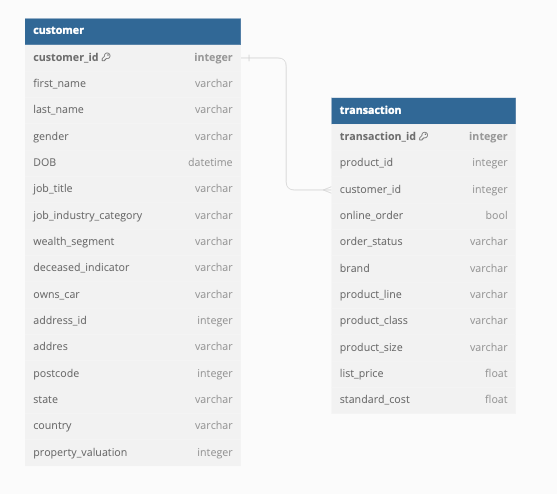
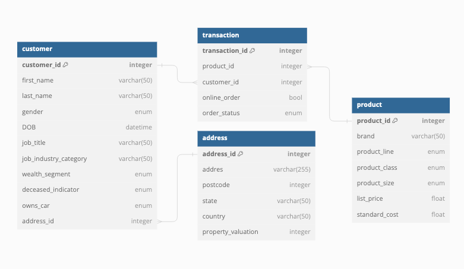
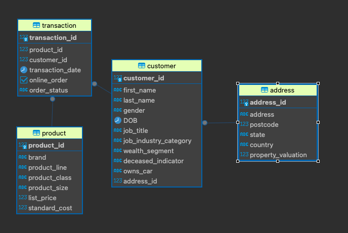
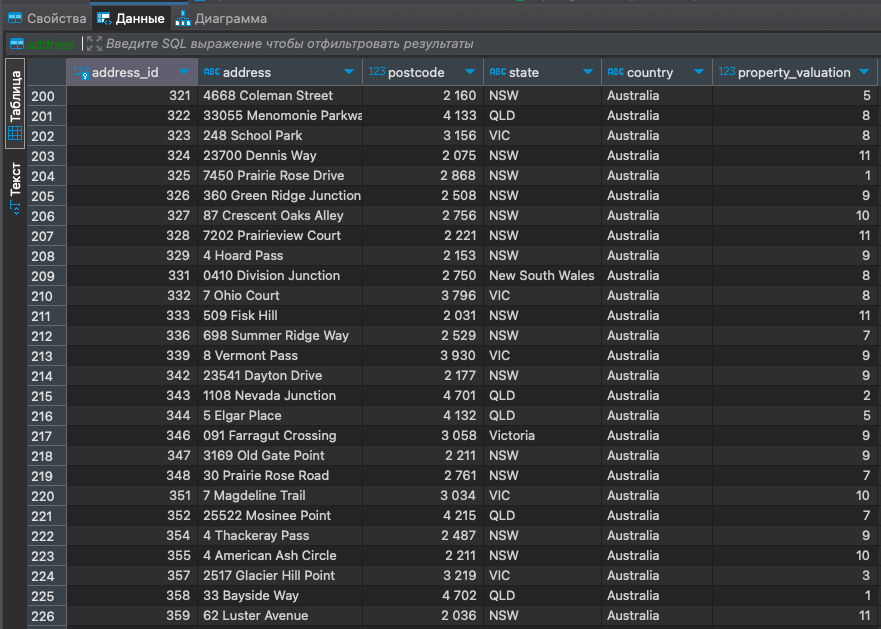
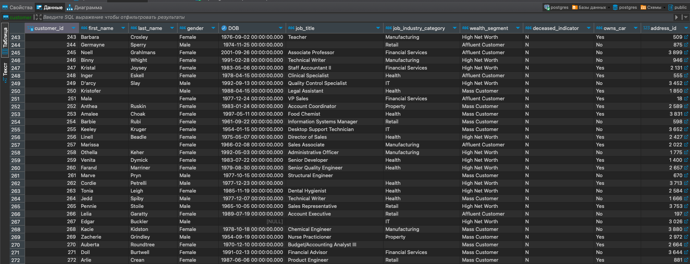
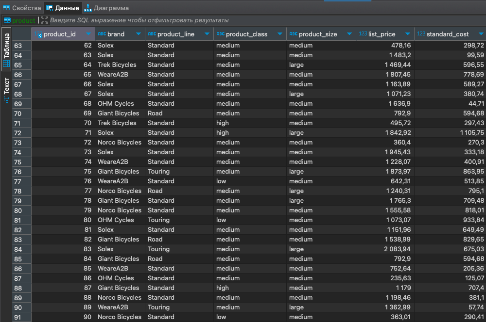
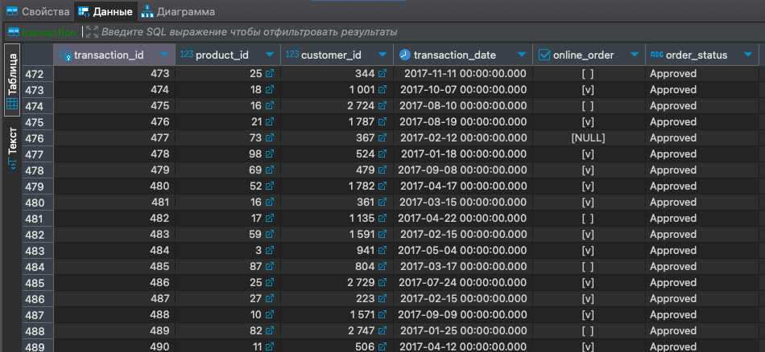

# Домашнее Задание №1
## Создание и нормализация базы данных (vo_HW)

Запуск Postgres:
```bash
docker run --name example  -p 5432:5432 -e POSTGRES_PASSWORD=example -d postgres
```

# Часть 1
Структура БД.
Для создания структуры БД воспользуемся сервисом dbdiagram.io
Структура предложенная в задании:



Скрипт для создания таблиц `non_normalize_tables.sql`

# Часть 2
Нормализуем структуру БД путем декомпозиции.

Требования к 3-й нормальной форме:
1. Таблица должна быть во 2-й нормальной форме.
2. Все атрибуты, не являющиеся первичными ключами, должны быть функционально зависимы от первичного ключа.

Рассмотрим отношение `customer`. Можно заметить, что атрибуты `address`, `postcode`,
`state`, `country` не зависят от первичного ключа `customer_id`. Поэтому выделим их в отдельную таблицу `address`.

Теперь рассмотрим отношение `transaction`. 
Атрибуты `brand`, `product_line`, `product_size`, `list_price`, и `standard_cost` 
могут быть зависимы не напрямую от `transaction_id`, а от `product_id`. 
Это означает, что эти поля лучше вынести в отдельную таблицу `product`.


Скрипт для создания таблиц расположен в файле `normalize_tables.sql`

Получившиеся отношения представлены на диаграмме:



Также отношения визуализированы в диаграмме DBeaver:



# Часть 3
Заполнение таблиц данными.
Для заполнения использовались запросы из файла `insert_data.sql`

Скриншоты заполнености таблиц:

Таблица `address`:



Таблица `customer`:



Таблица `product`:



Таблица `transaction`:


