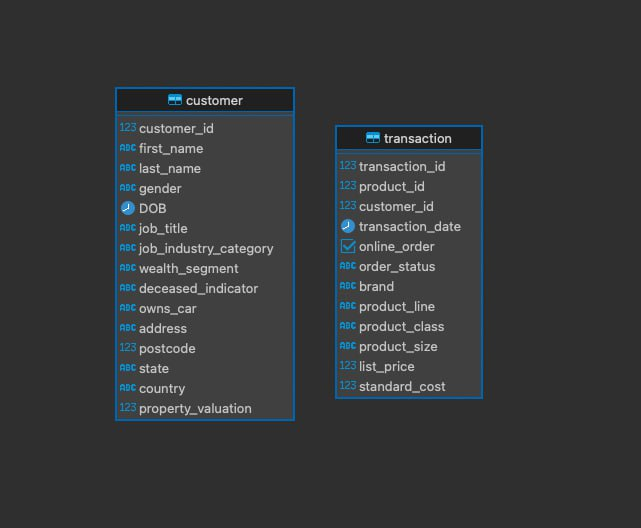

# Основные операторы PostgreSQL (vo_HW)

### 1. Создать таблицы со следующими структурами и загрузить данные из csv-файлов. Детали приведены ниже.

Воспользовавшись средствами DBeaver, получаем:



### 2. Выполнить следующие запросы:

#### - Вывести все уникальные бренды, у которых стандартная стоимость выше 1500 долларов.

Запрос:
```sql
SELECT DISTINCT brand
FROM transaction
WHERE standard_cost > 1500;
```
Результат:

| brand |
|---| 
| OHM Cycles | 
| Trek Bicycles |
| Solex |
| Giant Bicycles |

#### - Вывести все подтвержденные транзакции за период '2017-04-01' по '2017-04-09' включительно.

Запрос:
```sql
SELECT *
FROM transaction
WHERE order_status = 'Approved' AND transaction_date BETWEEN '2017-04-01' AND '2017-04-09'
ORDER BY transaction_date;
```
Результат (первые 3 строки):

| transaction_id | product_id | customer_id | transaction_date | online_order | order_status | brand | product_line | product_class | product_size | list_price | standard_cost |
| --- | --- | --- | --- | --- | --- | --- | --- | --- | --- | --- | --- |
| 1911 | 0 | 1109 | 2017-04-01 00:00:00.000000 | true | Approved | Norco Bicycles | Road | medium | medium | 543.39 | 407.54 |
| 126 | 53 | 773 | 2017-04-01 00:00:00.000000 | false | Approved | OHM Cycles | Standard | medium | medium | 795.34 | 101.58 |
| 83 | 0 | 3398 | 2017-04-01 00:00:00.000000 | true | Approved | OHM Cycles | Standard | medium | medium | 235.63 | 125.07 |

#### - Вывести все профессии у клиентов из сферы IT или Financial Services, которые начинаются с фразы 'Senior'.

Запрос:
```sql
SELECT job_title
FROM customer
WHERE job_title LIKE 'Senior%' AND (job_industry_category = 'IT' OR job_industry_category = 'Financial Services');
```
Результат (первые 3 строки) :

| job_title               |
|-------------------------|
| Senior Quality Engineer |
| Senior Cost Accountant  |
| Senior Financial Analyst |

#### - Вывести все бренды, которые закупают клиенты, работающие в сфере Financial Services

Запрос:
```sql
SELECT DISTINCT brand
FROM transaction
JOIN customer ON transaction.customer_id = customer.customer_id
WHERE job_industry_category = 'Financial Services' AND brand IS NOT NULL;
```
Результат:

| brand |
| --- |
| OHM Cycles |
| Trek Bicycles |
| WeareA2B |
| Solex |
| Norco Bicycles |
| Giant Bicycles |


#### - Вывести 10 клиентов, которые оформили онлайн-заказ продукции из брендов 'Giant Bicycles', 'Norco Bicycles', 'Trek Bicycles'.

Запрос:
```sql
SELECT customer.customer_id, first_name, last_name, brand, online_order
FROM transaction
JOIN customer ON transaction.customer_id = customer.customer_id
WHERE online_order = true AND brand IN ('Giant Bicycles', 'Norco Bicycles', 'Trek Bicycles')
LIMIT 10;
```
Результат:

| customer_id | first_name | last_name | brand | online_order |
|------------|-----------|----------| --- |-------------|
| 3120       | Lauree    | O'Donnell | Trek Bicycles | true        |
| 787        | Norma     | Batrim   | Giant Bicycles | true        |
| 2339       | Damien    | Haddeston | Giant Bicycles | true        |
| 1243       | Robbert   | Blakey   | Trek Bicycles | true        |
| 3002       | Tracey    | Verdun   | Giant Bicycles | true        |
| 2666       | Lyle      | Eager    | Trek Bicycles | true        |
| 3368       | Tanya     | Boddis   | Norco Bicycles | true        |
| 2810       | Malvin    | Burchill | Norco Bicycles | true        |
| 2003       | Lilli     | Hargey   | Trek Bicycles | true        |
| 2448       | Lorri     | Iston    | Norco Bicycles | true        |

#### - Вывести всех клиентов, у которых нет транзакций.

Запрос:
```sql
SELECT customer_id, first_name, last_name
FROM customer
WHERE customer_id NOT IN (SELECT customer_id FROM transaction);
```
Результат (первые 3 строки):

| customer_id | first_name | last_name |
|------------|-----------|----------|
| 852        | Andie     | Bonney   |
| 869        | Addia     | Abels    |
| 1373       | Shaylynn  | Epsley   |


#### - Вывести всех клиентов из IT, у которых транзакции с максимальной стандартной стоимостью.

Запрос:
```sql
SELECT customer.customer_id, first_name, last_name, job_industry_category,  standard_cost
FROM transaction
JOIN customer ON transaction.customer_id = customer.customer_id
WHERE job_industry_category = 'IT' AND standard_cost = (
    SELECT MAX(standard_cost)
    FROM transaction
);
```
Результат:

| customer_id | first_name | last_name | job_industry_category | standard_cost |
| --- | --- | --- | --- | --- |
| 3473 | Sanderson | Alloway | IT | 1759.85 |
| 893 | Gibby | Fearnley | IT | 1759.85 |
| 3151 | Thorn | Choffin | IT | 1759.85 |
| 34 | Jephthah | Bachmann | IT | 1759.85 |
| 2913 | Padraic | Bonnar | IT | 1759.85 |
| 1918 | Devin | Sandeson | IT | 1759.85 |
| 1672 | Sharla | Creebo | IT | 1759.85 |
| 975 | Goldarina | Rzehorz | IT | 1759.85 |
| 1773 | Nickolas | Guittet | IT | 1759.85 |


#### - Вывести всех клиентов из сферы IT и Health, у которых есть подтвержденные транзакции за период '2017-07-07' по '2017-07-17'.

Запрос:
```sql
SELECT customer.customer_id, first_name, last_name, job_industry_category, transaction_date, order_status
FROM transaction
JOIN customer ON transaction.customer_id = customer.customer_id
WHERE job_industry_category IN ('IT', 'Health') AND order_status = 'Approved' AND transaction_date BETWEEN '2017-07-07' AND '2017-07-17'
ORDER BY transaction_date;
```
Результат:

| customer_id | first_name| last_name | job_industry_category	 | transaction_date | order_status |
|------|--------|--------|---| ------- | ----------- |
| 2684	 | Erastus | Payley | Health | 2017-07-07 00:00:00.000000	| Approved |
| 350	 | Carmela	 | Jesper	|Health | 2017-07-07 00:00:00.000000 | Approved |
| 3288 | 	Fair  | Dewen	|IT	| 2017-07-07 00:00:00.000000 | Approved|
| 3173 | 	Angelo	| null	|Health	 | 2017-07-07 00:00:00.000000 | Approved |
| 300	 | Malachi	|Hadcroft	|Health	| 2017-07-07 00:00:00.000000 | Approved |
