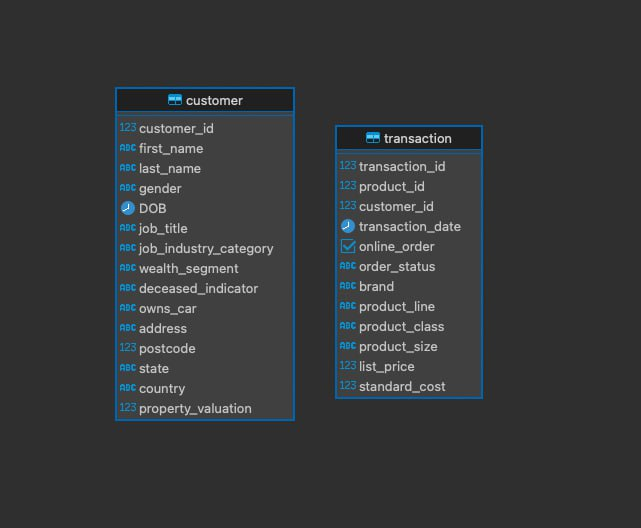

# Группировка данных и оконные функции (vo_HW)

### 1. Создать таблицы со следующими структурами и загрузить данные из csv-файлов (описание приведено ниже);

Воспользовавшись средствами DBeaver, получаем:



### 2. Выполнить следующие запросы:
#### - Вывести распределение (количество) клиентов по сферам деятельности, отсортировав результат по убыванию количества.

 - Запрос:
```sql
SELECT
    job_industry_category,
    COUNT(*) AS count
FROM customer
WHERE job_industry_category IS NOT NULL
GROUP BY job_industry_category
ORDER BY count DESC;
```
 - Результат:

| job\_industry\_category | count |
| :--- | :--- |
| Manufacturing | 799 |
| Financial Services | 774 |
| Health | 602 |
| Retail | 358 |
| Property | 267 |
| IT | 223 |
| Entertainment | 136 |
| Argiculture | 113 |
| Telecommunications | 72 |


#### - Найти сумму транзакций за каждый месяц по сферам деятельности, отсортировав по месяцам и по сфере деятельности.

 - Запрос:
```sql
SELECT
    date_trunc('month', transaction.transaction_date) as month,
    customer.job_industry_category as industry_category,
    SUM(transaction.list_price) as transaction_list_price_sum
FROM customer
JOIN transaction ON transaction.customer_id = customer.customer_id
WHERE customer.job_industry_category IS NOT NULL
GROUP BY month, job_industry_category
ORDER BY month, job_industry_category;
```

 - Результат (Первые 5 строчек):

| month | industry_category | transaction_list_price_sum   |
| --- |-------------------|-------------------|
| 2017-01-01 00:00:00.000000 | Argiculture       | 43513.81999999999 |
| 2017-01-01 00:00:00.000000 | Entertainment     | 64089.91999999999 |
| 2017-01-01 00:00:00.000000 | Financial Services | 366383.7100000002 |
| 2017-01-01 00:00:00.000000 | Health            | 286860.3800000003 |
| 2017-01-01 00:00:00.000000 | IT                | 107783.36999999997 |


#### - Вывести количество онлайн-заказов для всех брендов в рамках подтвержденных заказов клиентов из сферы IT.


 - Запрос:
```sql
SELECT
    brand,
    COUNT(*) AS 
FROM customer
JOIN transaction ON transaction.customer_id = customer.customer_id
WHERE (
    customer.job_industry_category = 'IT' and
    transaction.online_order is true and
    transaction.order_status = 'Approved' and
    brand IS NOT NULL
)
GROUP BY brand
ORDER BY count_online DESC;
```

 - Результат:

| brand | count_online |
| :--- |:-------------|
| Solex | 104          |
| Norco Bicycles | 95           |
| WeareA2B | 93           |
| Giant Bicycles | 93           |
| Trek Bicycles | 86           |
| OHM Cycles | 80           |


#### - Найти по всем клиентам сумму всех транзакций (list_price), максимум, минимум и количество транзакций, отсортировав результат по убыванию суммы транзакций и количества клиентов. Выполните двумя способами: используя только group by и используя только оконные функции. Сравните результат.

 - Запрос с использованием GROUP BY:
```sql
SELECT
    customer_id,
    SUM(list_price) AS sum_list_price,
    MAX(list_price) AS max_list_price,
    MIN(list_price) AS min_list_price,
    COUNT(*) AS count
FROM transaction
GROUP BY customer_id
ORDER BY sum_list_price DESC, count DESC;
```

 - Результат (Первые 5 строк):

| customer_id | sum_list_price     | max_list_price | min_list_price | count |
|-------------|--------------------|----------------|----------------|-------|
| 2183        | 19071.32           | 2005.66        | 230.91         | 14    |
| 1129        | 18349.27           | 1992.93        | 290.62         | 13    |
| 1597        | 18052.68           | 2091.47        | 360.4          | 12    |
| 941         | 17898.46           | 2091.47        | 1057.51        | 10    |
| 2788        | 17258.94           | 2083.94        | 183.86         | 11    |

 - Запрос с использованием оконных функций:
```sql
SELECT
    customer_id,
    SUM(list_price) OVER (PARTITION BY customer_id) AS sum_list_price,
    MAX(list_price) OVER (PARTITION BY customer_id) AS max_list_price,
    MIN(list_price) OVER (PARTITION BY customer_id) AS min_list_price,
    COUNT(*) OVER (PARTITION BY customer_id) AS count
FROM transaction
ORDER BY sum_list_price DESC, count DESC;
```

 - Результат:

| customer_id | sum_list_price | max_list_price | min_list_price | count |
|-------------|----------------|----------------|----------------|-------|
| 2183        | 19071.32       | 2005.66        | 230.91         | 14    |
| 2183        | 19071.32       | 2005.66        | 230.91         | 14    |
| ...         | ...            | ...            | ...            | ...   |
| 1597        | 18052.68       | 2091.47        | 360.4          | 12    |
| 1597        | 18052.68       | 2091.47        | 360.4          | 12    |

 - Сравнение:

* При использовании агрегирующих функций предложение **GROUP BY** сокращает количество строк в запросе с помощью их группировки, в отличие от оконных функций, где количество строк в запросе не уменьшается. 


#### - Найти имена и фамилии клиентов с минимальной/максимальной суммой транзакций за весь период (сумма транзакций не может быть null). Напишите отдельные запросы для минимальной и максимальной суммы.

 - Запрос:
```sql
WITH transaction_sum AS (
    SELECT
        customer.first_name,
        customer.last_name,
        SUM(transaction.list_price) AS sum_transaction_list_price
    FROM customer
    JOIN transaction ON transaction.customer_id = customer.customer_id
    GROUP BY customer.first_name, customer.last_name
), min_sum AS (
    SELECT
        MIN(sum_transaction_list_price) AS min_sum_transaction_list_price
    FROM transaction_sum
), max_sum AS (
    SELECT
        MAX(sum_transaction_list_price) AS max_sum_transaction_list_price
    FROM transaction_sum
)

SELECT
    first_name,
    last_name,
    sum_transaction_list_price
FROM transaction_sum
WHERE (
    sum_transaction_list_price = (SELECT min_sum_transaction_list_price FROM min_sum) or
    sum_transaction_list_price = (SELECT max_sum_transaction_list_price FROM max_sum)
);
```

 - Результат:

| first_name | last_name | sum_transaction_list_price |
|------------|-----------|----------------------------|
| Jillie     | Fyndon    | 19071.32                   |
| Hamlen     | Slograve  | 60.34                      |


#### - Вывести только самые первые транзакции клиентов. Решить с помощью оконных функций.

 - Запрос:
```sql
WITH level_transactions AS (
    SELECT *,
           ROW_NUMBER() OVER (PARTITION BY customer_id ORDER BY transaction_date) AS ln
    FROM transaction
)
SELECT transaction_id,
       customer_id,
       transaction_date
FROM level_transactions
WHERE ln = 1
ORDER BY customer_id;
```

 - Результат (Первые 5 строк):

| transaction_id | customer_id | transaction_date           |
|----------------|-------------|----------------------------|
| 9785           | 1           | 2017-01-05 00:00:00.000000 |
| 2261           | 2           | 2017-05-04 00:00:00.000000 |
| 10302          | 3           | 2017-02-23 00:00:00.000000 |
| 12441          | 4           | 2017-04-03 00:00:00.000000 |
| 2291           | 5           | 2017-03-03 00:00:00.000000 |


#### - Вывести имена, фамилии и профессии клиентов, между транзакциями которых был максимальный интервал (интервал вычисляется в днях)

 - Запрос:
```sql
WITH customer_transaction_interval AS (
    SELECT
        customer.first_name,
        customer.last_name,
        customer.job_title,
        EXTRACT(
            DAY FROM (
                transaction_date - LAG(transaction_date)
                OVER (PARTITION BY customer.customer_id ORDER BY transaction_date)
            )
        ) AS interval_day
    FROM transaction JOIN customer ON customer.customer_id = transaction.customer_id
), max_interval AS (
    SELECT
        MAX(interval_day) AS max_interval_day
    FROM customer_transaction_with_interval
)

SELECT
    *
FROM customer_transaction_interval
WHERE interval_day = (SELECT max_interval_day FROM max_interval);
```

 - Результат:

| first_name | last_name | job_title       | interval_day   |
|------------|-----------|-----------------|----------------|
| Susanetta  | null      | Legal Assistant | 357            |